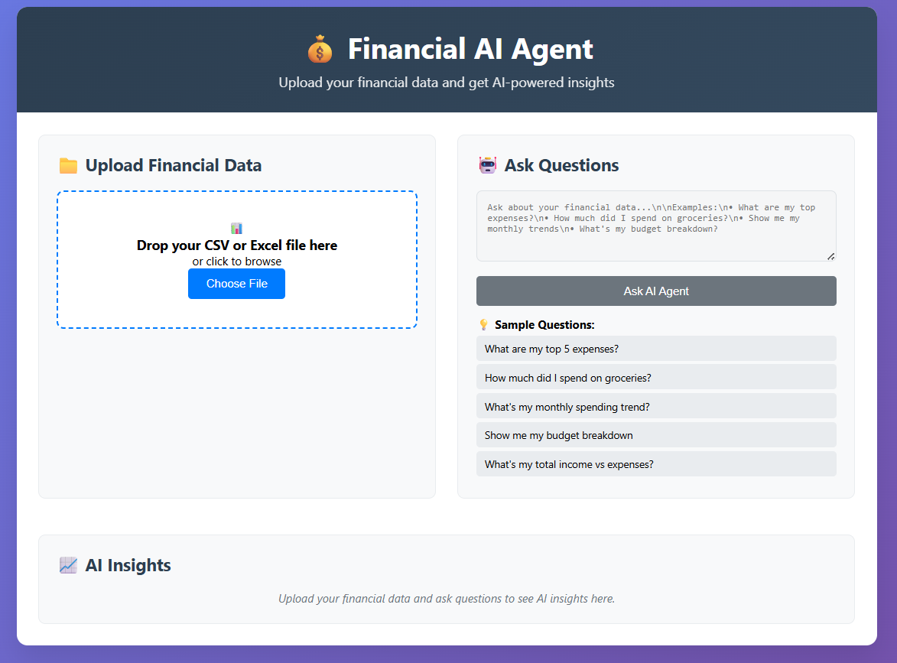
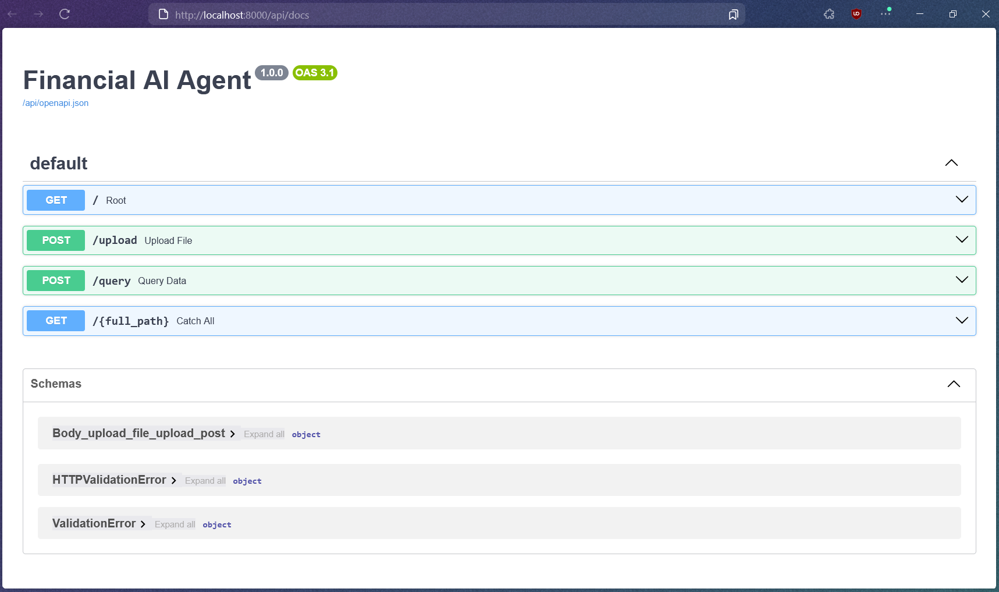
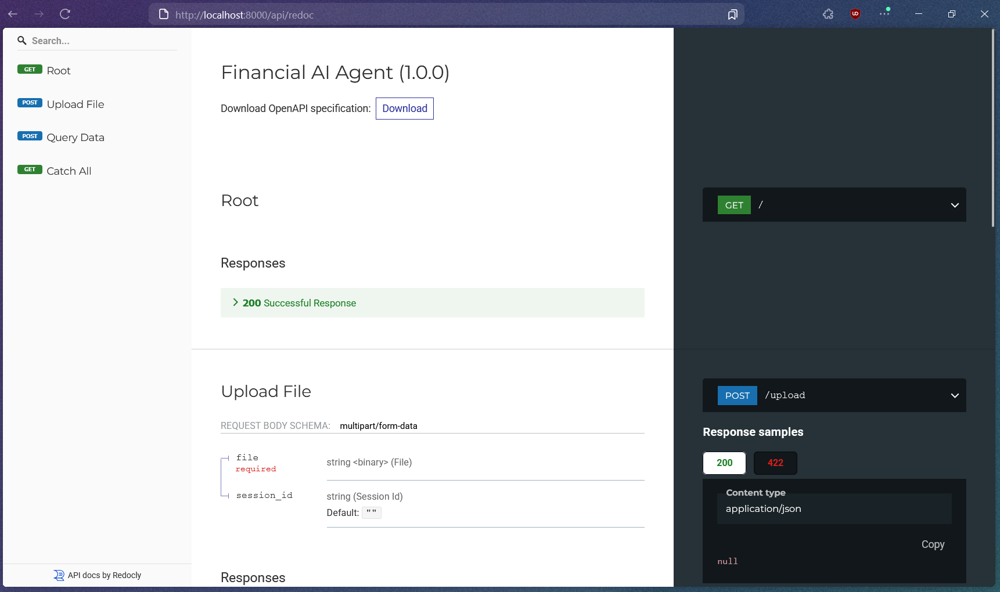

# LLM-based Financial AI Agent

A powerful AI-driven financial analysis tool that leverages Google's Gemini LLM to provide intelligent insights and recommendations based on your financial data. Upload CSV or Excel files and interact with your data through natural language queries.


## Main Features

- **Multi-format Data Support**: Upload CSV or Excel files containing financial data
- **AI-Powered Analysis**: Uses Google's Gemini 2.0 Flash model for intelligent insights
- **Natural Language Queries**: Ask questions in plain English about your financial data
- **Web Interface**: Beautiful, responsive web UI for easy interaction
- **Real-time Processing**: Fast file processing and instant AI responses
- **Session Management**: Secure session-based data handling

## Screenshots

### Web Interface

*Web interface for uploading data and querying insights*

### API Documentation

*API documentation with Swagger UI*


*Alternative API documentation with ReDoc*

### AI Chat Results

*Sample AI-powered financial insights and analysis*
## Quick Start

### Prerequisites

- Python 3.8 or higher
- Google Gemini API key
- Web browser (Chrome, Firefox, Safari, or Edge)

### Installation

1. **Clone the repository**
   ```bash
   git clone <repository-url>
   cd LLM-based-Financial-AI-Agent
   ```

2. **Install dependencies**
   ```bash
   pip install -r requirements.txt
   ```

3. **Set up environment variables**
   - Copy `.env.example` to `.env`
   - Add your Gemini API key:
   ```bash
   GEMINI_API_KEY=your_gemini_api_key_here
   ```

4. **Run the application**
   ```bash
   python main.py
   ```

5. **Access the web interface**
   - Open your browser and go to: `http://localhost:8000`

## 🗂️ Project Structure

```
LLM-based-Financial-AI-Agent/
├── static/                 # Static files (CSS, JS, images), for future use
├── templates/             
│   └── web_interface.html  # Web UI template
├── uploads/               # Uploaded files storage
├── .env.example          # Environment variables template
├── llm_agent.py          # LLM integration module
├── main.py               # FastAPI application
├── requirements.txt      # Python dependencies
├── sample_data.csv       # Sample financial data
└── README.md            # This file
```

## Configuration

### Environment Variables

Create a `.env` file in the root directory:

```bash
# Google Gemini API Configuration
GEMINI_API_KEY=your_gemini_api_key_here
```

### Getting a Gemini API Key

1. Visit [Google AI Studio](https://aistudio.google.com/app/apikey)
2. Create a new API key
3. Copy the key to your `.env` file

## Usage

### Web Interface

1. **Upload Data**: Drag and drop or click to upload CSV/Excel files
2. **Ask Questions**: Use natural language to query your data
3. **View Insights**: Get AI-powered analysis and recommendations

### Sample Queries

- "What are my top 5 expenses?"
- "How much did I spend on groceries this month?"
- "What's my monthly spending trend?"
- "Show me my budget breakdown"
- "What's my total income vs expenses?"

### API Endpoints

#### 1. Upload Financial Data
```http
POST /upload
Content-Type: multipart/form-data

Parameters:
- file: CSV or Excel file
- session_id: Optional session identifier
```

**Response:**
```json
{
  "status": "success",
  "session_id": "unique-session-id",
  "filename": "financial_data.csv",
  "rows_processed": 1500,
  "columns": [
    {"name": "Date", "type": "string"},
    {"name": "Amount", "type": "string"}
  ],
  "preview": [...]
}
```

#### 2. Query Financial Data
```http
POST /query
Content-Type: application/json

{
  "session_id": "unique-session-id",
  "prompt": "What are my top expenses?"
}
```

**Response:**
```json
{
  "status": "success",
  "response": "Based on your financial data, your top expenses are...",
  "model": "gemini-2.0-flash",
  "tokens": {
    "prompt": 150,
    "completion": 200,
    "total": 350
  },
  "metadata": {
    "session_id": "unique-session-id",
    "prompt": "What are my top expenses?",
    "timestamp": "2024-01-20T10:30:00Z"
  }
}
```

## Supported Data Formats

### CSV Files
- Comma-separated values
- UTF-8 encoding recommended
- First row should contain column headers

### Excel Files
- `.xlsx` and `.xls` formats
- Single sheet processing
- Headers in first row

### Sample Data Structure
```csv
Date,Category,Description,Amount,Type
2024-01-15,Groceries,Weekly shopping,-120.50,Expense
2024-01-16,Salary,Monthly salary,3000.00,Income
2024-01-17,Utilities,Electric bill,-85.20,Expense
```

## Development

### Running in Development Mode

```bash
# Install development dependencies
pip install -r requirements.txt

# Run with auto-reload
uvicorn main:app --reload --host 0.0.0.0 --port 8000
```

### API Documentation

- **Swagger UI**: `http://localhost:8000/api/docs`
- **ReDoc**: `http://localhost:8000/api/redoc`


## Error Handling

The application includes comprehensive error handling for:

- **Invalid File Formats**: Only CSV and Excel files accepted
- **Empty Files**: Validation for file content
- **API Errors**: Graceful handling of Gemini API issues
- **Network Issues**: Timeout and connection error management
- **Invalid Queries**: User-friendly error messages

